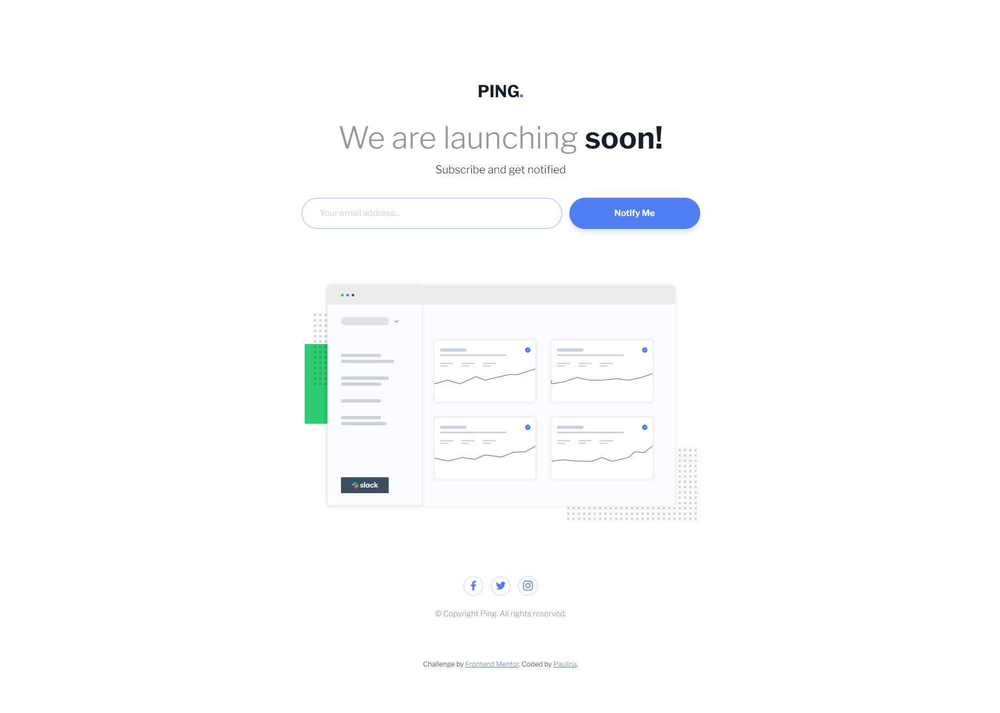
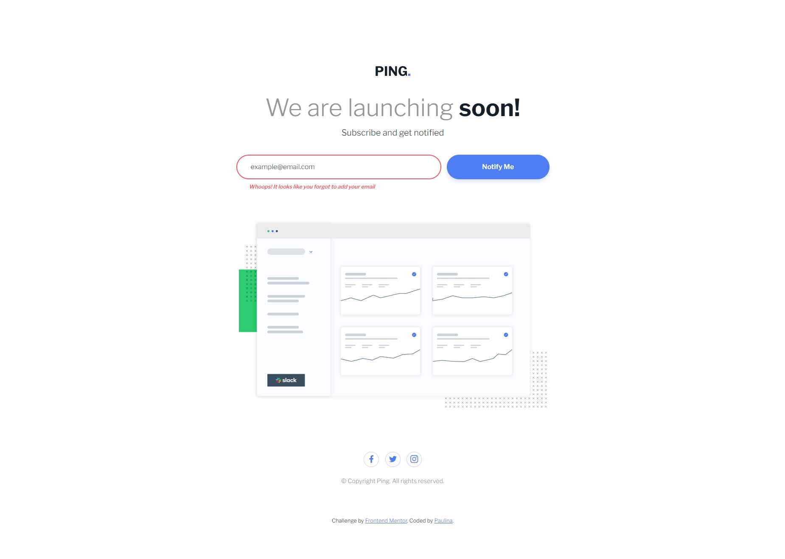

# Frontend Mentor - Ping coming soon page solution

This is a solution to the [Ping coming soon page challenge on Frontend Mentor](https://www.frontendmentor.io/challenges/ping-single-column-coming-soon-page-5cadd051fec04111f7b848da).

## Table of contents

- [Overview](#overview)
  - [The challenge](#the-challenge)
  - [Screenshots](#screenshots)
  - [Links](#links)
- [My process](#my-process)
  - [Built with](#built-with)
  - [What I learned](#what-i-learned)

## Overview

The challenge was to create a responsive landing page with an email subscription feature.

### The challenge

Users should be able to:

- View the optimal layout for the site depending on their device's screen size
- See hover states for all interactive elements on the page
- Submit their email address using an `input` field
- Receive an error message when the `form` is submitted if:
	- The `input` field is empty. The message for this error should say *"Whoops! It looks like you forgot to add your email"*
	- The email address is not formatted correctly (i.e. a correct email address should have this structure: `name@host.tld`). The message for this error should say *"Please provide a valid email address"*

### Screenshots

### Links

- Live Site URL: [Add live site URL here](https://your-live-site-url.com)

## My process

The project was constructed using HTML, CSS, and JavaScript. HTML was used for the basic structure of the page, defining sections like the header, main content, form, and footer. CSS, including advanced features like custom properties (CSS variables) and media queries, was employed to style the page and make it responsive. JavaScript played a crucial role in adding interactivity to the email form, including validation of email input and display of appropriate error or success messages

### Built with

- Semantic HTML5 markup
- CSS custom properties
- Flexbox
- CSS Grid
- Mobile-first workflow
- JavaScript

### What I learned

This challenge was an excellent learning experience for me. I honed my skills in responsive design, utilizing techniques like media queries and responsive units. I also gained valuable practice in manipulating the DOM and handling events with JavaScript.